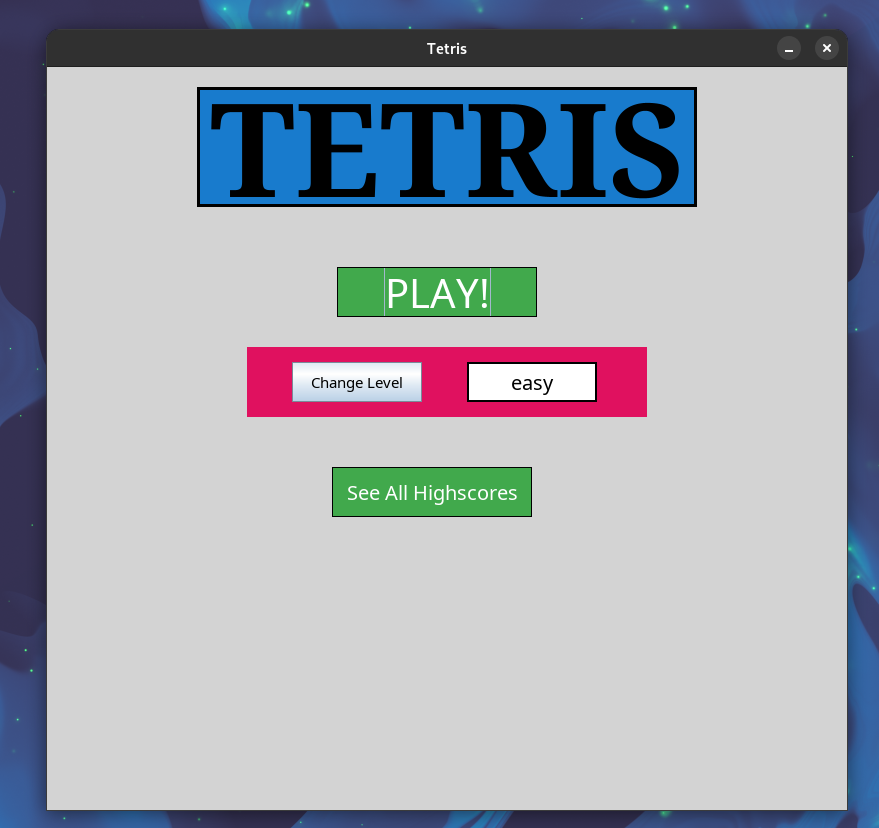
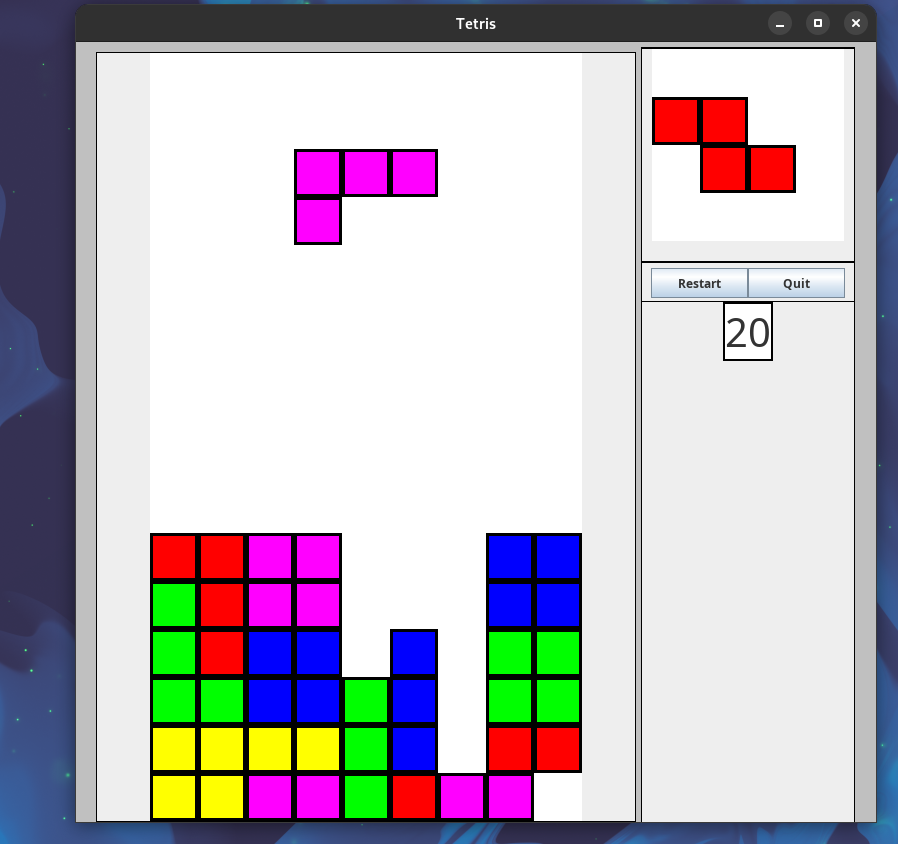
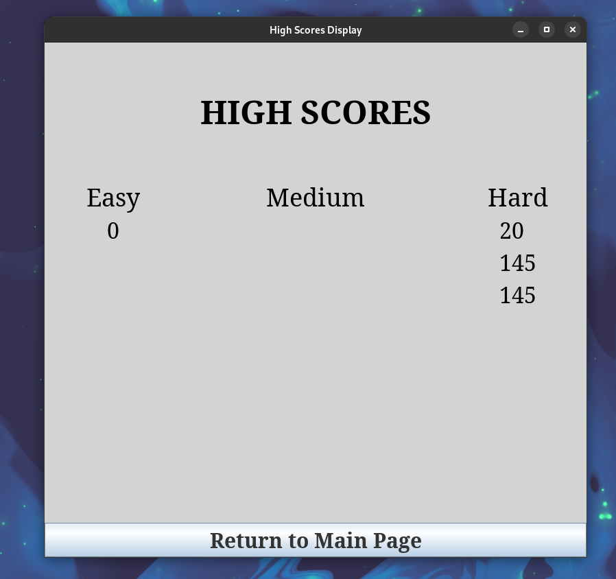

# Java Swing Tetris Game

Tetris game in Java built using Swing API in a team of 3 as a final project for CSCI2300 - Object-Oriented Software Design.
## Run
This app uses `gradle` as its building tool, once its installed running `gradle run` should be enough. 
## Screenshots

